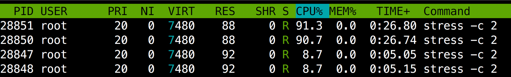

# 04 Play with cgroups & namespaces (Part 2)

Now, we shall utilize some proper tools.
>**Name**
>
>cgcreate - create new cgroup(s)
>
> **Synopsis**
>
>cgcreate [-h] [-s] [-t <tuid>:<tgid>] [-a <agid>:<auid>] [-f mode] [-d mode] -g <controllers>:<path> [-g ...]
>
>**Description**
>
>The command creates new cgroup(s) defined by option -g.

>**Name**
>
>cgexec - run the task in given control groups
>
> **Synopsis**
>
>cgexec [-g <controllers>:<path>] [--sticky] command [arguments]
>
>**Description**
>
>The cgexec program executes the task command with arguments arguments in given control groups.

Also look up the man pages for `cgget` and `cgset`.

### Exercise

Please start the following as root user, in the folder where you created the container from section 01. 
In the next excercise we will use `cgcreate` to create a `/sandbox` control group. These groups can be hierarchicaly stacked and configured, thus offering detailed means to instruct "fairer" control over the Linux [Completely Fair Scheduler](https://en.wikipedia.org/wiki/Completely_Fair_Scheduler) which internally only handles `struct task_struct`.

>[Processes vs. threads](https://www.ibm.com/developerworks/linux/library/l-completely-fair-scheduler/)
>
>Linux incorporates process and thread scheduling by treating them as one and the same. A process can be viewed as a single thread, but a process can contain multiple threads that share some number of resources (code and/or data).

First we inspect `/proc/self/cgroup` in order to compare the situation later from inside the container. Furthermore, we limit the cpu.shares to 100 of 1024 (roughly 10%) for our `/sandbox` group. Lastly, we start a shell in this group using `cgexec`, `unshare` the namespaces for mnt, uts, ipc & pid and `chroot` into our prepared container directory.

```
# cat /proc/self/cgroup
11:devices:/user.slice
10:memory:/user.slice
9:cpu,cpuacct:/user.slice
8:blkio:/user.slice
7:hugetlb:/
6:net_cls,net_prio:/
5:cpuset:/
4:pids:/user.slice/user-1000.slice
3:perf_event:/
2:freezer:/
1:name=systemd:/user.slice/user-1000.slice/session-18.scope

# cgcreate -g cpu,memory,blkio,devices,pids,freezer:/sandbox
# cgget -r cpu.shares /sandbox
/sandbox:
cpu.shares: 1024

# cgset -r cpu.shares=100 /sandbox  #100 of 1024 shares 

# cgexec -g cpu,memory,blkio,devices,pids,freezer:/sandbox \
	unshare --mount --uts --ipc --pid --fork chroot container

bash-4.3# cat /proc/self/cgroup
11:devices:/sandbox
10:memory:/sandbox
9:cpu,cpuacct:/sandbox
8:blkio:/sandbox
7:hugetlb:/
6:net_cls,net_prio:/
5:cpuset:/
4:pids:/sandbox
3:perf_event:/
2:freezer:/sandbox
1:name=systemd:/user.slice/user-1000.slice/session-18.scope
```
Inside our "container", we confirm that the `sandbox` group has been applied. Next, we confirm that our process is projected into its own mnt, uts and pid namespace. As evident, your "container" can only see its own processes. We even set a custom hostname for this environment.
```
bash-4.3# ps -efa
Error, do this: mount -t proc proc /proc
bash-4.3# mount -t proc proc /proc
bash-4.3# mount
proc on /proc type proc (rw,relatime)

bash-4.3# ps -efa
UID        PID  PPID  C STIME TTY          TIME CMD
0            1     0  0 13:38 ?        00:00:00 /bin/bash -i
0            7     1  0 13:42 ?        00:00:00 ps -efa

bash-4.3# hostname
ubuntu-xenial
bash-4.3# hostname hugabuga
bash-4.3# hostname
hugabuga
```
In another shell, check if we actually changed the hostname of our system?

In the next experiment, we stress all the cores in our system with a sample load utility `stress -c 2` (here, the argument to -c is the number of cores in my system).

If you look at the load with `htop`, you will find that despite limiting  the cpu shares to 10%, the process (one per cpu) is consuming 100% of the available cpu. Only when activating other, unrestricted load competing for cpu, will you find roughly the expected 10% ratio of cpu share reserved for your container.


When exiting our container, some changes were confined in dedicated namespaces associated to the `chroot` process, e.g. mounting the `/proc` filesystem or setting a hostname. Thus, after exiting that process, the namespaces were lost and the root environment is not tainted.

The advanced reader could now immerse himself into the man page for [nsenter](http://man7.org/linux/man-pages/man1/nsenter.1.html) and as exercise try to enter into the namespace of our running container process.  