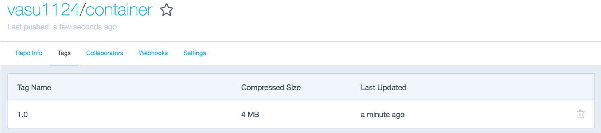

# 06 Swarm Intelligence with Container Registries

Obtain a free account at your favorite hosted Container Registry, [Docker Hub](https://hub.docker.com/), [Quay](https://quay.io/) or others. In the following examples, we will be using the most popular registry Docker Hub, which is the default with the docker cli & runtime. For an overview and comparison of public/hosted/private/on-premise registry options check [link 1](http://rancher.com/container-registries-might-missed/) and [link 2](http://blog.wercker.com/ultimate-guide-to-container-registries)

### Exercise

We will upload/push our container image into a public repository. First, we login to the registry; this is only required once, the docker cli saves your authorization credentials under `~/.docker/config.json`. Next, we tag the image with a url tag `docker.io/vasu1124/container:1.0` or for Docker Hub in short `vasu1124/container:1.0`; for other registries you have to use an absolute url. Lastly, if everything works, the image is pushed.
```
# docker tag container:1.0 vasu1124/container:1.0
# docker login
Login with your Docker ID to push and pull images from Docker Hub. If you don't have a Docker ID, head over to https://hub.docker.com to create one.
Username: vasu1124
Password: <password>
Login Succeeded

# docker push vasu1124/container:1.0
The push refers to a repository [docker.io/vasu1124/container]
5b73e1d6f17e: Pushed
1.0: digest: sha256:c668d2784a267f29ee6c397537c48454c3dba829da2f513b37a5fafd16975fac size: 527
```

If you now open the Browser to https://hub.docker.com/r/vasu1124/container/tags/, you will find our container image publicly accessible.


How about logging into a fresh system with docker installed and running `docker run -it vasu1124/container:1.0 /bin/bash`? If you do, you have just experienced the container benefits of standardized packaging & distribution. No need for complex installations & scripting.

The container image can now be used and/or extended by a community of users for which this image might be of interest. Beware that you are responsible for [ensuring copyrights, licenses and export controls](https://www.docker.com/docker-terms-service) are observed. All registry services offer multiple advanced, mostly paid features, ranging from integrating source to image CI/CD build pipelines to security & vulnerability scanners (see the Ubuntu [example](https://hub.docker.com/r/library/ubuntu/tags/latest/)).

It is now time to tap into the collective contributions of a decentralized, self-organized community and search for an image you can directly use (instead of building it from scratch):
```
# docker search centos
NAME                               DESCRIPTION                                     STARS     OFFICIAL   AUTOMATED
centos                             The official build of CentOS.                   4101      [OK]
ansible/centos7-ansible            Ansible on Centos7                              105                  [OK]
jdeathe/centos-ssh                 CentOS-6 6.9 x86_64 / CentOS-7 7.4.1708 x8...   93                   [OK]
consol/centos-xfce-vnc             Centos container with "headless" VNC sessi...   48                   [OK]
imagine10255/centos6-lnmp-php56    centos6-lnmp-php56                              40                   [OK]
tutum/centos                       Simple CentOS docker image with SSH access      36
gluster/gluster-centos             Official GlusterFS Image [ CentOS-7 +  Glu...   25                   [OK]
centos/python-35-centos7           Platform for building and running Python 3...   19
...
smartentry/centos                  centos with smartentry                          0                    [OK]
openshift/wildfly-81-centos7       A Centos7 based WildFly v8.1 image for use...   0

# docker search gentoo
NAME                                          DESCRIPTION                                     STARS     OFFICIAL   AUTOMATED
gentoo/stage3-amd64                                                                           65                   [OK]
gentoo/portage                                                                                30                   [OK]
gentoo/stage3-amd64-hardened                  Official Gentoo stage3-amd64-hardened Image     17                   [OK]
gentoo/stage3-amd64-nomultilib                Official Gentoo stage3-amd64-nomultilib Image   14                   [OK]
plabedan/gentoo-minimal                       Gentoo minimal image (stage3 + portage)         7
```
You can now choose from various options. Docker Hub offers some KPIs, such as how many "Stars" has the image obtained from the users, is it an "official" build from docker, or is an "automated" build process attached.

First, let us inspect the host system:
```
# cat /etc/os-release
NAME="Ubuntu"
VERSION="16.04.4 LTS (Xenial Xerus)"
ID=ubuntu
...

# uname -a
Linux ubuntu-xenial 4.4.0-116-generic #140-Ubuntu SMP Mon Feb 12 21:23:04 UTC 2018 x86_64 x86_64 x86_64 GNU/Linux
```
So this is an Ubuntu with an Ubuntu kernel.

Now, let us download, run and inspect the official `centos:7` image:
```
# docker run -it centos:7 /bin/bash
Unable to find image 'centos:7' locally
7: Pulling from library/centos
5e35d10a3eba: Pull complete
Digest: sha256:dcbc4e5e7052ea2306eed59563da1fec09196f2ecacbe042acbdcd2b44b05270
Status: Downloaded newer image for centos:7

[root@f6ebd1b19515 /]# cat /etc/os-release
NAME="CentOS Linux"
VERSION="7 (Core)"
ID="centos"
...

[root@f6ebd1b19515 /]# ls -la
[snip ... looks like a full operating system!]

[root@f6ebd1b19515 /]# uname -a
Linux f6ebd1b19515 4.4.0-116-generic #140-Ubuntu SMP Mon Feb 12 21:23:04 UTC 2018 x86_64 x86_64 x86_64 GNU/Linux

[root@f6ebd1b19515 /]# exit
```
Woa. Inside the container, it feels like a wholehearted CentOS. But the kernel is an Ubuntu? ... Get used to it. This is the new world of containers, your RHEL based image might run on a SLES kernel and vice versa, your support matrix just got hyperboled :-)

### Export

Where you can import, you can also export (need to keep the trade balance in check):
```
# mkdir centos
# cd centos; docker export f6ebd1b19515 | tar xf -
```
Your local folder `~/centos` now includes a complete CentOS v7 root filesystem. If you [figure out](https://github.com/linuxkit/linuxkit) where to get kernel & initrd from and how to appropriatly boot into that system, you have an installer for an Operating System.

### Curated images from Docker
Checkout https://hub.docker.com/explore/ and more recently https://store.docker.com/ for curated and well maintained Docker images with many open source and commercial software products.

Lastly, there are two CNCF incubating projects dealing with managing cryptographic based trust and integrity of image & contents:
[The Update Framework (TUF)](https://github.com/theupdateframework/specification) and
[Notary](https://github.com/theupdateframework/notary).
